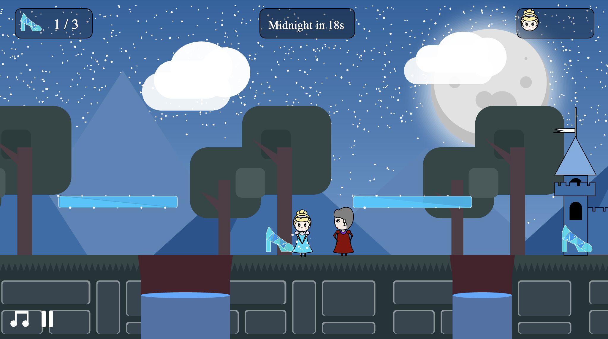

# Cinderella Game - 2D Platform Game using p5.js 🎮

# Overview
In the development of this game project, I aimed to create an engaging 2D platform game inspired by classics like "Mario." The project encompasses various extensions grouped into categories, including aesthetics, mechanics, and diversity.

## Aesthetics
- **Custom Graphic Designs:** The game features custom graphics designed with a Cinderella theme, creating an aesthetically pleasing experience targeted at a younger audience.
- **Death Animation:** The death animation displays a splash screen indicating the player's remaining lives, reminiscent of the popular game "Mario."
- **Instruction and Starting Screens:** Clear instructions and starting screens are incorporated to provide players with guidance, ensuring a smooth transition into the game.

## Mechanics
- **Jump Acceleration:** Enhanced jump physics with acceleration for a more realistic and animated gaming experience.
- **Sound Effects:** Various sound effects for walking on different surfaces and platforms, adding an auditory dimension to the game.
- **Countdown Timer, Moving Platform, and Enemy:** Introduced to intensify the gaming experience, bringing excitement and challenge to the gameplay.

## Diversity
- **Multiple Levels:** Designed different levels to offer gamers varying degrees of challenges, ensuring a diverse and engaging experience.
- **Pause Feature:** Implemented a pause feature for players to take a break and resume gameplay at their convenience.
- **Music Controls:** Players can control background music, providing flexibility and customization options.

## Challenges and Learning
Whilst the project was overall successful, one notable challenge was implementing the "translate" function in p5.js. This challenge presented an opportunity for skill development and problem-solving, enabling the addition of the side scroll function and the game title "Cinderella Game" to the introduction page.

Throughout the completion of this game project, I gained valuable programming skills. Learning when to apply the factory pattern and constructor function enhanced code organisation and efficiency. The project served as an excellent learning experience, contributing to both technical and design skill development.

## Screenshots/GIFs

## Getting Started, Playing Game
You may view and play the game on my personal website! Recommend to play on desktop.

## Technologies Used
- p5.js
- HTML/CSS
- VSCode
- Git/GitHub
- Game Development Concepts
- UI/UX Design

## Acknowledgments
Would like to thank Coursera, University of London for allowing me to get started using Javascript

## License
Sound effects obtained from https://www.zapsplat.com

Feel free to reach out for any inquiries or collaborations!

suahkeagan@gmail.com

Thank you all for your support!

---
